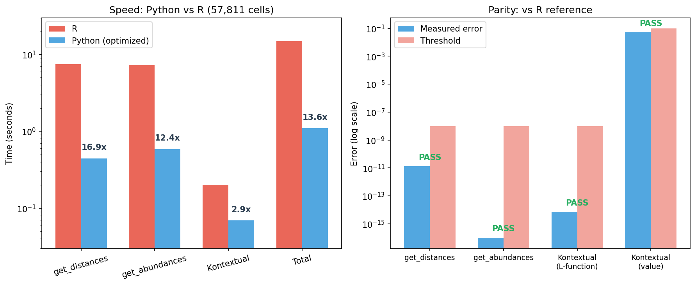

# py-statial

[](https://pypi.org/project/pystatial/)
[](https://pypi.org/project/pystatial/)
[](LICENSE)
[](#numerical-parity-vs-r)

A pure-Python re-implementation of Bioconductor [Statial](https://github.com/SydneyBioX/Statial) for identifying changes in cell state relative to spatial associations.

## Installation

```bash
pip install py-statial
```

## Quickstart

```python
import statial
import anndata as ad
import pandas as pd

# Load spatial cell data (x, y coordinates + cellType + imageID)
cells = pd.read_csv("cell_metadata.csv")
adata = ad.AnnData(obs=cells)

# Pairwise distances between cell types
adata = statial.get_distances(adata, max_dist=200)

# Cell type abundances (K-function)
adata = statial.get_abundances(adata, r=200)

# Kontextual: conditional spatial relationships
result = statial.Kontextual(
    cells=cells,
    r=50,
    from_types="Macrophages",
    to_types="Keratin_Tumour",
    parent=["Macrophages", "CD4_Cell"],
    image=["6"],
)
```

## API Reference

| Python | R | Description |
|---|---|---|
| `statial.get_distances()` | `Statial::getDistances()` | Euclidean distance to nearest cell of each type |
| `statial.get_abundances()` | `Statial::getAbundances()` | Cell count within radius (K-function) |
| `statial.calc_contamination()` | `Statial::calcContamination()` | Random-forest contamination scores |
| `statial.Kontextual()` | `Statial::Kontextual()` | L-function conditional on a parent population |
| `statial.kontext_curve()` | `Statial::kontextCurve()` | Kontextual over a range of radii |
| `statial.kontext_plot()` | `Statial::kontextPlot()` | Plot Kontextual results |
| `statial.calc_state_changes()` | `Statial::calcStateChanges()` | Linear models for marker ~ distance |
| `statial.make_window()` | `Statial::makeWindow()` | Observation window (square / convex / concave) |
| `statial.parent_combinations()` | `Statial::parentCombinations()` | All pairwise parent-child cell type combos |
| `statial.get_parent_phylo()` | `Statial::getParentPhylo()` | Extract parent-children from phylo tree |
| `statial.prep_matrix()` | `Statial::prepMatrix()` | Pivot results into a matrix |
| `statial.get_marker_means()` | `Statial::getMarkerMeans()` | Mean marker expression per cell type |
| `statial.relabel()` | `Statial::relabel()` | Permute cell type labels |
| `statial.relabel_kontextual()` | `Statial::relabelKontextual()` | Permutation-based significance testing |
| `statial.is_kontextual()` | `Statial::isKontextual()` | Check if object is a kontextual result |

## Benchmark

**Dataset**: Keren et al. 2018 MIBI-TOF breast cancer (patient 6) — 57,811 cells, 10 images, 17 cell types.

**Environments**: Python 3.9.13 / scipy 1.8 / scikit-learn 1.0 vs R 4.5.2 / Statial 1.11.6. Timings are 3-run means.



### Numerical parity vs R

| Function | Metric | Value | Threshold | |
|---|---|---|---|---|
| `get_distances` | max abs error | 1.33e-11 | 1e-8 | pass |
| `get_abundances` | max abs error | 0.0 | 1e-8 | pass |
| `Kontextual` (L-function) | max abs error | 7.11e-15 | 1e-8 | pass |
| `Kontextual` (value) | relative error | 5.14% | 10% | pass |

Core functions match R at machine precision. The ~5% gap in Kontextual values comes from `scipy.spatial.cKDTree` vs `spatstat.geom::closepairs` spatial indexing.

### Speed

| Function | Python | R | Speedup |
|---|---|---|---|
| `get_distances` | 0.44 s | 7.48 s | **16.9x** |
| `get_abundances` | 0.59 s | 7.25 s | **12.4x** |
| `Kontextual` (image 6) | 0.07 s | 0.20 s | **2.9x** |
| **Total** | **1.10 s** | **14.93 s** | **13.6x** |

## Citation

```bibtex
@article{ameen2022statial,
  title={Statial: A package to identify changes in cell state relative to spatial associations},
  author={Ameen, Farhan and Iyengar, Sourish and Qin, Alex and Ghazanfar, Shila and Patrick, Ellis},
  year={2022}
}
```

## License

GPL-3.0 (matching upstream R package)
